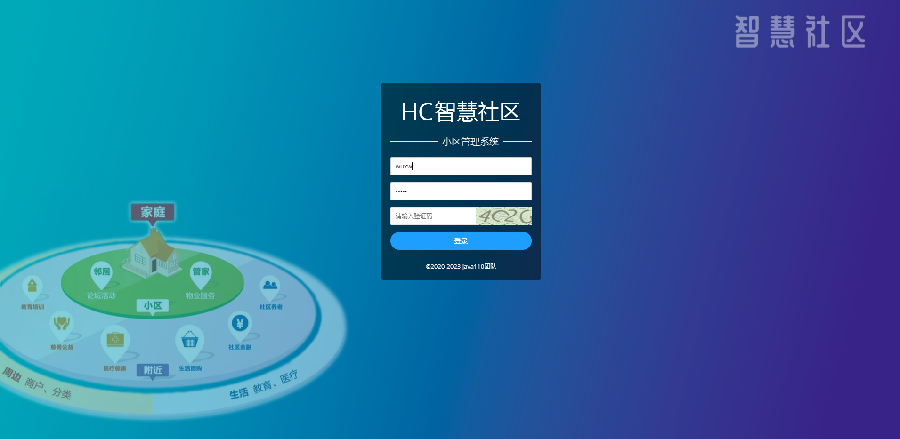
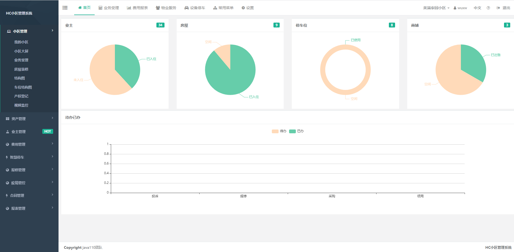
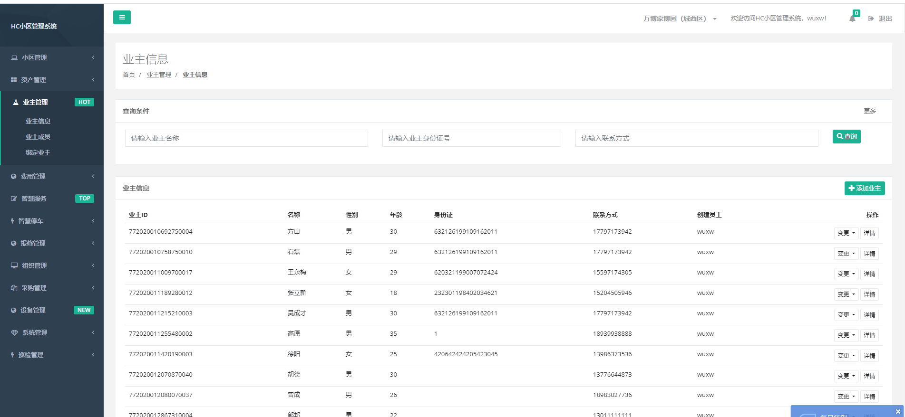

# HC小区管理系统是前后端完全开源的小区物业管理系统，包含小区后端项目，小区前段项目，物业版APP和业主版小程序,QQ群: 827669685

## 开源代码说明

### HC小区后端代码
 [https://gitee.com/wuxw7/MicroCommunity](https://gitee.com/wuxw7/MicroCommunity)
### HC小区前段代码
[https://gitee.com/java110/MicrCommunityWeb](https://gitee.com/java110/MicrCommunityWeb)
### HC智慧家庭（业主版）
[https://gitee.com/java110/WechatOwnerService](https://gitee.com/java110/WechatOwnerService)
### HC掌上物业（物业版）
[https://gitee.com/java110/PropertyApp](https://gitee.com/java110/PropertyApp)

### 系统简介（introduction）

1. 开发工具：

nodejs + vscode + MicroCommunity(HC小区后端)

2. 官方网站

   http://www.homecommunity.cn
   
   技术业务交流群QQ: 827669685

3. 环境搭建

    将app.js 中代码

    > app.use('/callComponent',proxy('http://192.168.0.104:8012',opts));
    中IP换为后端MicroCommunity项目FrontService服务地址

### 演示地址（demo）

[http://www.homecommunity.cn/](http://www.homecommunity.cn/)

物业 账号/密码：wuxw/admin

代理商 账号/密码：dails/admin

运维团队 账号/密码：admin/admin

开发团队 账号/密码：dev/(由于开发者权限较大，删除数据会影响稳定性，查看具体功能，可以单独部署查看)

### 运行效果（view）
1.在浏览器输入 https://localhost:8443/ 如下图

    用户名为 wuxw 密码为 admin  如下图

    点击登录，进入如下图：
    

